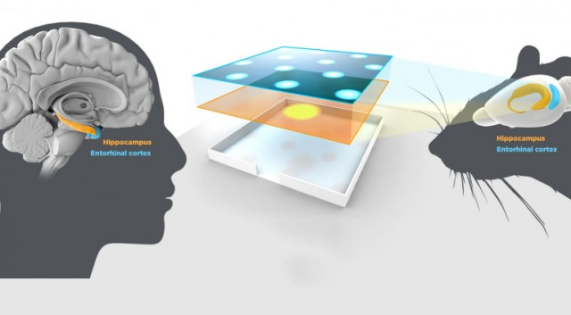
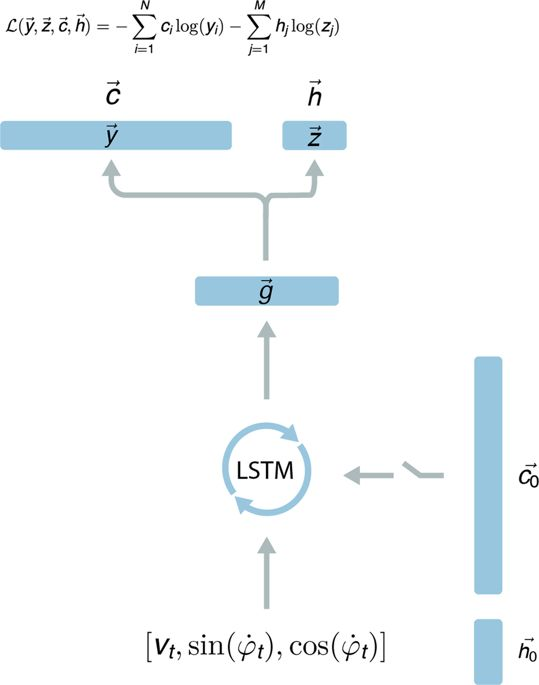

# Vector-based Navigation using Grid-like Representations in Artificial Agents
<p align="center">
  
</p>

## About
Replicating Google Deepmind's paper ["Vector-based Navigation using Grid-like Representations in Artificial Agents"](https://deepmind.com/blog/grid-cells/).

It has been a long day, you are really tired and you just arrived home. You open the door and you don't have to turn on the lights but you can successfully reach the bed and felt asleep. 
How it has been possible?

You were tired and you didn't even see where you were going. Despite this, you moved through a familiar environment easily. 

Mainly, this achievement has been possible due to the work done in the Hippocampus and in the Entorhinal cortex. In fact, it is believed that particular neurons in these regions of the brain allow us to self-localize and to navigate through environments. In these regions of the brain there are neurons that fire depending on where we are: Place cells and others that fire based on which direction we are facing: Head-direction Cells..

[What are Grid cells?  Full article about the paper here](http://www.stefanorosa.me/topicboard/artificialIntelligence/spatialNavigation)

## Dependencies
* Tensorflow
* Numpy
* Matplotlib

## Network
<p align="center">
  
</p>

## Getting started
`ratSimulator.py` contains the code used to generate the trajectories. The simulator is based on [this paper](https://journals.plos.org/ploscompbiol/article/file?id=10.1371/journal.pcbi.1002553&type=printable).

`dataGenerator.py` is used to create the **Place Cell Distributions** and **Head Cell Distributions**

`agent.py` contains the architecture of the network in Tensorflow.

In order to start the training, `main.py` must be called.


```
	python3 main.py train
```

This command will load the `trajectoriesDataTesting.pickle` if already exist. Othwerwise, it is going to create 10 trajectories to use for testing the network accuracy. 

Successivelly, the program generates 500 trajectories of 800 timesteps each. They are fed into the network at batches of 10 trajectories at the time. After 50 training steps, all the 500 trajectories have been fed, so new 500 trajectories are generated.

```
	python3 main.py showcells
```

It will use the trained agent to generate 5000 trajectories of 800 timsteps each and show the linear layer **activity maps** for each neuron as well as the auto-correlations

## Result
The agent has been able to self-localize itself with a mean error of 12cm.

Unfortunately, I have not been able to reproduce the same results. In fact, in the **Linear layer** there isn't the emerging of grid-like representations and their correlation map doesn't show hexagonal periodicity.


## Sources
* [Nature paper](https://www.nature.com/articles/s41586-018-0102-6) by Deepmind
* [Deepmind article](https://deepmind.com/blog/grid-cells/)
* [What are Grid cells? article about the paper](http://www.stefanorosa.me/topicboard/artificialIntelligence/spatialNavigation)
